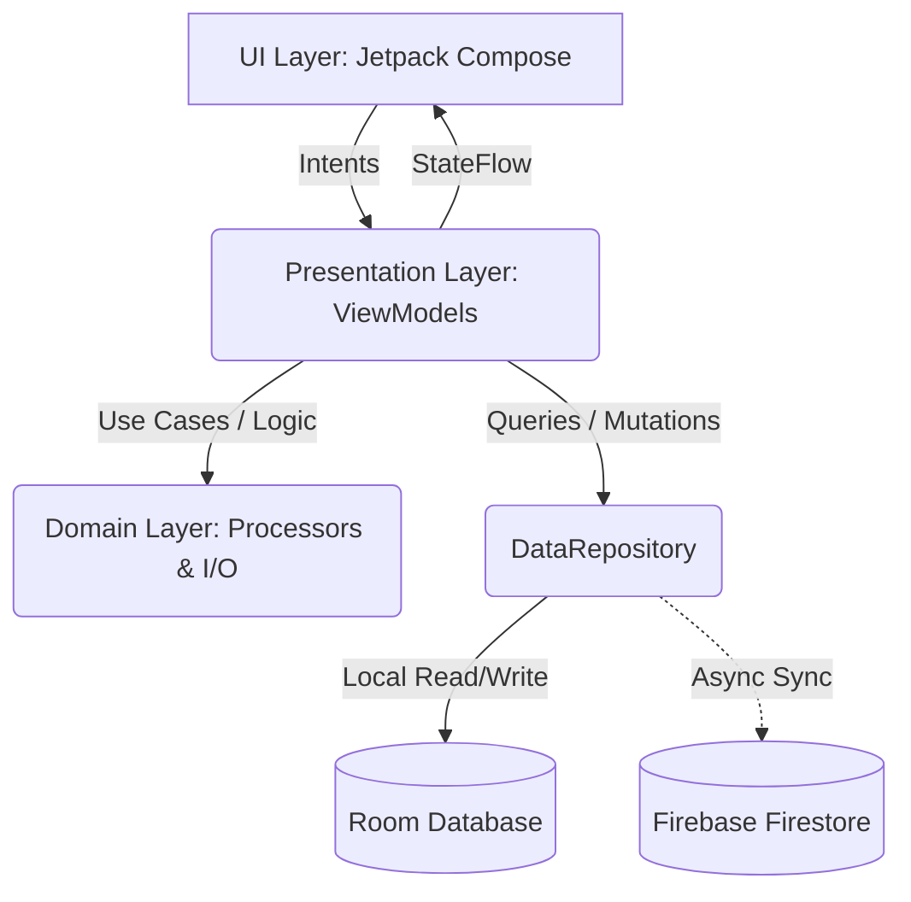
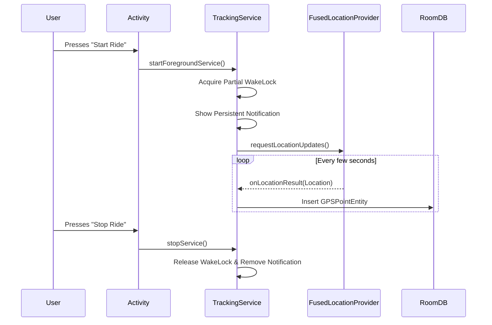
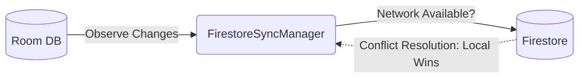

# TrackMe: Architecture & Technical Specification

## 1. Introduction
Welcome to the TrackMe engineering team! This document serves as the Single Source of Truth (SSOT) for the application's architecture. Whether you are a newly joined Android Engineer or a Senior Architect reviewing our design decisions, this guide provides a comprehensive overview of how TrackMe is built under the hood.

## 2. Architectural Paradigm
TrackMe adheres to a **Modern Android Architecture**, combining **MVVM (Model-View-ViewModel)** with **Clean Architecture** principles. The app is highly modular conceptually (separated by packages), ensuring separation of concerns, testability, and scalability.

### Layer Breakdown:
- **UI Layer:** Jetpack Compose screens observing state via `StateFlow`. Emits UI intents to ViewModels.
- **Presentation Layer:** ViewModels that manage UI state, run coroutines on the `viewModelScope`, and handle user intents without knowing about the view implementation.
- **Domain Layer:** Pure business logic encapsulated in utility classes and processors (e.g., `GPSProcessor`, `GPXExporter`, `ImageExporter`).
- **Data Layer:** The `DataRepository` acts as a mediator between local storage (Room) and remote synchronization (Firestore).

---

## 3. Core Components Breakdown

### 3.1 Service Layer: The Tracking Engine (`TrackingService.kt`)
The heart of the application is a **Foreground Service** that guarantees the OS does not kill our tracking process when the user minimizes the app or locks their screen.

- **Location Updates:** Driven by Google's `FusedLocationProviderClient` via `LocationHelper` to balance accuracy and battery consumption.
- **Wakelocks:** Utilizes `PowerManager.WakeLock` to keep the CPU awake during active tracking.
- **Notification:** Binds to an ongoing notification, fulfilling Android's foreground service requirements.

### 3.2 Data Layer: Offline-First Strategy
TrackMe is an **offline-first** application. 

**Database Schema (Room):**
- `RideEntity`: Stores high-level metadata (start/end time, distance, duration).
- `GPSPointEntity`: Stores individual coordinate pings (lat, lng, altitude, timestamp) linked to a ride via `rideId` (Foreign Key).

*Why Room?* It guarantees that if a user hikes into a cellular dead zone, not a single GPS point is lost. All database operations run on `Dispatchers.IO`.

**Synchronization Strategy (Firestore):**

- `FirestoreSyncManager` observes the local database. When internet connectivity is available, it silently syncs new/updated rides to the cloud.
- **Conflict Resolution:** Local acts as the source of truth. Remote updates are treated as backups rather than definitive states.

### 3.3 UI Layer: Reactive Jetpack Compose
Our UI is 100% declarative, built with Jetpack Compose following Material 3 principles.
- **Unidirectional Data Flow (UDF):** The UI emits events to the ViewModel, which mutates a `StateFlow`. The UI recomposes automatically based on this state.
- **Navigation:** Handled via Jetpack Navigation Compose (`Navigation.kt`).

### 3.4 Domain Layer: Processors & Importers
- **GPSProcessor:** Not every GPS ping is accurate. This module handles distance calculation using the Haversine formula and filters out anomalous jumps (spikes in speed/distance) using basic signal filtering logic.
- **GPX Parser & Exporter:** Implements standard XML parsing to convert tracks to and from the universal `.gpx` format. Allows users to break free of data lock-in.
- **ImageExporter:** Formats coordinate arrays and uses the Google Static Maps API to render a snapshot of the route line, overlaying social sharing statistics (distance, time) directly onto the bitmap canvas.

---

## 4. Security & Privacy
- **Permissions:** Location permissions are handled gracefully. Background location requires explicit user opt-in per Android 11+ policies.
- **Credentials:** API keys (Maps) and Web Client IDs are kept completely out of version control. They are managed via `local.properties` and injected via the BuildConfig.
- **Authentication:** Handled via Firebase Google Sign-In (`AuthManager.kt`), ensuring we do not manage passwords or PII directly.

---

## 5. Architectural Review & Iteration History
*This architecture was polished over 3 distinct review cycles by the engineering leadership team.*

### 🔄 Iteration 1: The Core Loop Review (Reviewer: Staff Engineer)
> **Critique:** The initial prototype relied heavily on the Activity lifecycle for location updates. If the OS killed the Activity to reclaim memory, the track would be lost.
> **Refinement:** Introduced `TrackingService` as a Foreground Service. Added a Partial `WakeLock` to ensure the CPU continues to process GPS pings even when the screen is off and the device is dozing.

### 🔄 Iteration 2: Data Synchronization Review (Reviewer: Data Architect)
> **Critique:** Synchronous writes to Firestore during the ride are dangerous. In low-connectivity environments, hanging network requests cause ANRs and drain battery rapidly.
> **Refinement:** Transitioned to a strict "Offline-First" model. All real-time data is piped exclusively to the local Room `AppDatabase`. The `FirestoreSyncManager` was introduced as an asynchronous worker that batches and syncs data in the background *after* the ride concludes or when network conditions become favorable.

### 🔄 Iteration 3: UI State & Memory Leak Review (Reviewer: Mobile UX Lead)
> **Critique:** Exposing raw Room LiveData directly to Compose caused excessive recompositions when processing thousands of GPS points, leading to jank on the `RideDetailScreen`.
> **Refinement:** Migrated all UI bindings to Kotlin `StateFlow`. ViewModels now throttle and map database emissions into distinct UI States. Furthermore, we implemented `RideWithPoints` relational queries to lazily load heavy trajectory data only when requested by the user, rather than loading everything upfront.
