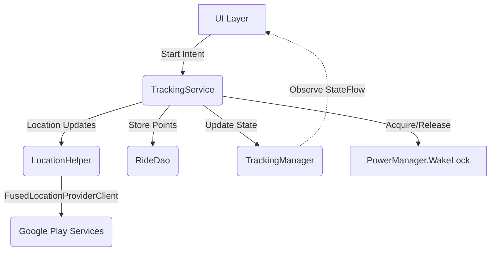
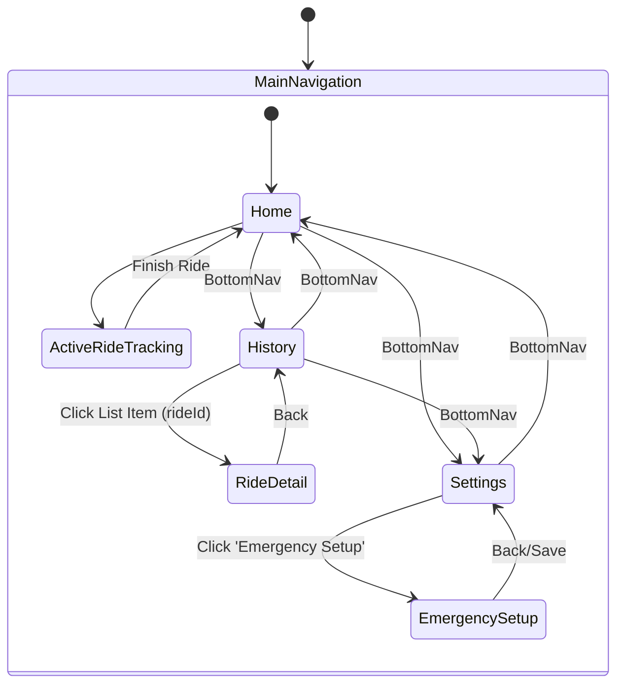

# TrackMe: Developer Overview Guide

This guide provides a high-level overview of the TrackMe Android application's architecture, configurations, and core flows to help new developers understand how the components interact.

## 1. App Configuration (`AppConfig.kt`)

The central configuration for the app is located in `com.example.trackme.config.AppConfig`. It dictates visual styling, thresholds, and emergency behaviors:

*   **Map Rendering Constants:** `MAP_LINE_COLOR`, `MAP_LINE_WEIGHT`, `STATIC_MAP_BASE_URL`
*   **High Quality Image Export:** Resolutions and aspect ratios (`HQ_IMAGE_WIDTH`, `HQ_IMAGE_RATIO_1_1`, `HQ_IMAGE_RATIO_16_9`), retina scaling.
*   **Social Template Rendering:** `OVERLAY_BANNER_HEIGHT_RATIO` (bottom 20%), colors, and alpha transparency.
*   **Emergency Configuration:** 
    *   `SOS_COUNTDOWN_SECONDS`: 5 seconds countdown before broadcasting SOS.
    *   `MAX_HAPTIC_MESSAGES`: 5 broadcast ticks for haptic vibration feedback.
    *   `HAPTIC_VIBRATION_DURATION_MS`: 1000ms duration for each vibration.
*   **Post Processing:** `MAX_ACCELERATION_G` (1.5f) used by the `GPSProcessor` to filter out impossible speed jumps.

## 2. Services Dependency & Interaction

The core of the tracking system runs in a Foreground Service to ensure longevity.

*   **`TrackingService`**: A Foreground Service that runs the primary tracking loop. It manages its own CoroutineScope, binds to the `TrackingManager` to push real-time UI updates, and talks to the `RideDao` to persist `GPSPointEntity` rows instantly.
*   **`LocationHelper`**: Wraps the `FusedLocationProviderClient`. Requests location updates.
*   **`TrackingManager`**: A singleton state holder (often provided via dependency injection or App context). Exposes `StateFlow` streams for `trackingState`, `pathPoints`, `currentSpeed`, `totalDistance`, and `rideDurationInMillis`. This is how Jetpack Compose screens know what to render during an active ride without directly binding to the service.
*   **`WakeLock`**: Held as a `PARTIAL_WAKE_LOCK` to ensure the CPU doesn't sleep while tracking, even when the screen is off.

## 3. Data Layer Methods & Syncing

The application uses an "Offline-First" model. All writes happen locally via Room, and a background sync manager handles cloud operations.

### Local Storage (`RideDao` & `EmergencyDao`)
*   **Methods:** `insertRide`, `updateRide`, `insertGPSPoints`, `getPointsForRide`, `getRideWithPointsById`, `getAllRidesWithPoints`.
*   **Relation:** Uses `RideWithPoints` (a Room relation linking `RideEntity` to a List of `GPSPointEntity`) to easily load a full trajectory.

### Remote Sync (`FirestoreSyncManager`)
*   **`syncAll()`**: Syncs rides up to the cloud and downloads remote rides down to the local database.
*   **`uploadRide(rideId: Long)`**: Takes a local ride, constructs a JSON/Map payload (including calculated stats and the compressed array of points), and sets it in the user's `rides` collection on Firestore.
*   **`downloadFromCloud(uid: String)`**: Pulls rides from the `users/{uid}/rides` collection, checks if they exist locally, and inserts them if they are new. Re-maps Firestore GeoPoints/Data into Room Entities.
*   **Emergency Sync**: `syncEmergencyConfigUpstream` and `syncEmergencyConfigDownstream` ensure SOS settings and contacts are synced cross-device.

## 4. Screen Flow Diagram

Navigation is handled declaratively using Jetpack Navigation Compose (`Navigation.kt`).

*   **Home (`HomeScreen`)**: Entry point. Start/Stop rides via swipe-to-trigger slider. Shows live stats and map.
*   **History (`HistoryScreen`)**: Paginated/Scrollable list of past rides. 
*   **Ride Detail (`RideDetailScreen`)**: Deep view of a single ride. Renders the static map export, detailed stats, and options to export as GPX or share an image.
*   **Settings (`SettingsScreen`)**: Preferences (e.g., Post-processing toggles) and entry to Emergency Setup.
*   **Emergency Setup (`EmergencySetupScreen`)**: Configure SOS contacts and message templates.
