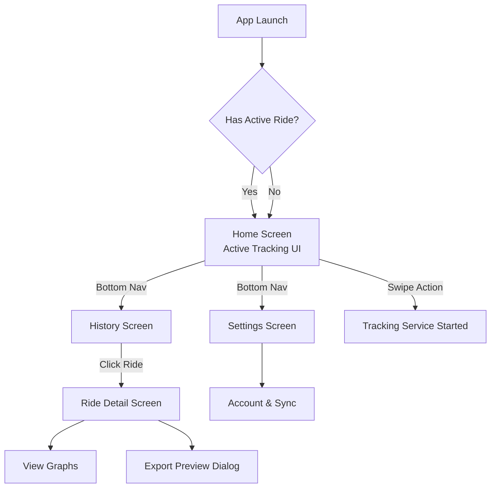

# TrackMe - Product Documentation

Welcome to the TrackMe Product Documentation. This document provides a comprehensive overview of the product's features, privacy postures, technical prerequisites, and target audience. 

For implementation details, architecture, and code logic, please refer to the [Technical Documentation](technical_documentation.md).

## 1. Core Features & Capabilities

Each feature is designed with a privacy-first, offline-capable approach.

### 1.1. Real-Time Tracking & Ride History
*   **Product Behavior:** Users can start a ride to record highly accurate GPS tracking with live metric calculations (Current Speed, Altitude, Distance, Duration). Finished rides are saved locally and displayed in a high-density compact list with sticky section headers and vector route thumbnails.
*   **Privacy Control:** Data is stored locally on the device by default, ensuring offline tracking capabilities.
*   🔗 **Tech Link:** [Real-Time Tracking Implementation](technical_documentation.md#11-real-time-tracking--ride-history)

### 1.2. Live Ride Sharing
*   **Product Behavior:** Users can share their real-time ride progress with friends or family via a secure live-tracking link directly from the Home Screen before or during their ride.
*   **Privacy Control:** Links are generated per ride and can be revoked. Only users with the link can view the progress.
*   🔗 **Tech Link:** [Live Ride Sharing Logic](technical_documentation.md#12-live-ride-sharing)

### 1.3. Cloud Synchronization
*   **Product Behavior:** Seamless, opt-in Google Sign-In and Firestore synchronization. It features automated daily background syncing with lightweight downstream lazy-loading and a manual "Cloud Sync" button.
*   **Privacy Control:** Opt-in only. Users can manually delete individual rides, purge their history, or sign out to stop cloud sync entirely.
*   🔗 **Tech Link:** [Cloud Sync Architecture](technical_documentation.md#13-cloud-synchronization)

### 1.4. Data Export & GPX Interoperability
*   **Product Behavior:** Avoids data lock-in by providing full support for exporting individual routes to standard `.gpx` files for platforms like Strava or Garmin. Users can also request a complete **Cloud Data Archive Export** (.zip) of their synchronized history. The API returns a tokenized download URL and assembles the ZIP on demand.
*   🔗 **Tech Link:** [GPX Processing Logic](technical_documentation.md#14-gpx-import--export)

### 1.5. Social Sharing (Image Export)
*   **Product Behavior:** A WYSIWYG export preview allowing users to frame their route, apply a customized data overlay, and share a high-quality static image of their route to social media.
*   🔗 **Tech Link:** [Image Export Implementation](technical_documentation.md#15-social-sharing-image-export)

### 1.6. In-App Auto-Update Notifications
*   **Product Behavior:** Non-blocking version checks on app launch to alert users of new versions. Presents an interactive Material 3 release notes popup when an update is available.
*   🔗 **Tech Link:** [Auto-Update Flow](technical_documentation.md#16-in-app-auto-update-notifications)

### 1.7. Multi-Language Localization
*   **Product Behavior:** Built-in dynamic locale support for 7 languages (English, Spanish, French, German, Hindi, Japanese, Chinese) across all application screens.
*   🔗 **Tech Link:** [Localization Strategy](technical_documentation.md#17-multi-language-localization)

---

## 2. Security, Privacy, and Permissions

TrackMe is built with a **Privacy-First** approach. User location data is highly sensitive, and we provide transparent controls over how data is collected and managed.

### Permissions: When and For What
*   **Location (Precise & Approximate)**: Requested when the user starts their first track. Required to record the geographical path.
*   **Background Location**: Requested optionally for users who want to lock their phones or switch apps while tracking. Without it, tracking stops when the app goes into the background.
*   **Notifications (Android 13+)**: Requested to show an ongoing notification (required for Foreground Services).

---

## 3. Screen Wireframes & App Flow

The following diagram illustrates the navigational flow and structural layout of the application's screens.

---

## 4. Target Audience

TrackMe is designed for:
*   **Cyclists & Mountain Bikers**: Who need offline tracking and altitude metrics on remote trails.
*   **Runners & Hikers**: Who want a lightweight, ad-free alternative to heavy fitness apps.
*   **Privacy-Conscious Individuals**: Users who want to track their fitness but refuse to upload their location data to third-party servers by default.
