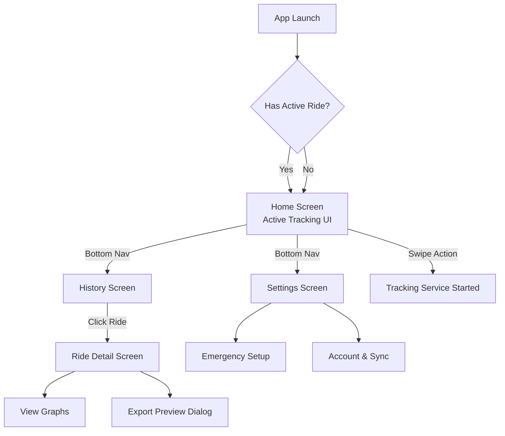
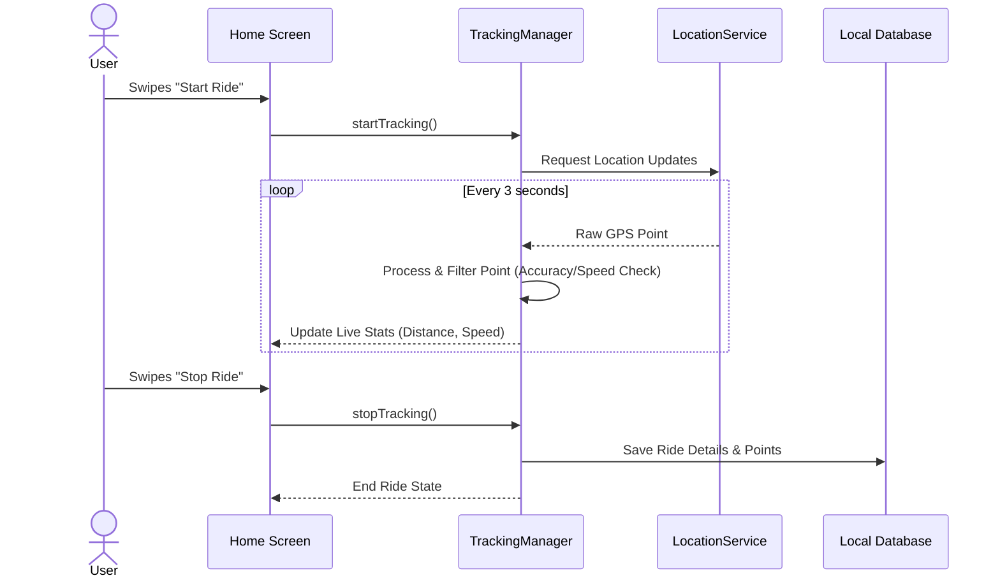
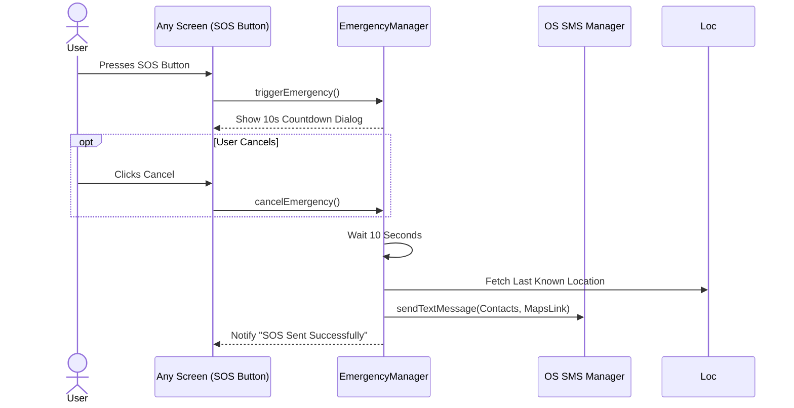

# TrackMe - Product Documentation

Welcome to the TrackMe Product Documentation. This document provides an overview of the product's features, privacy and security postures, technical prerequisites, and target audience.

## 1. Security and Privacy

TrackMe is built with a **Privacy-First** approach. User location data is highly sensitive, and we provide transparent controls over how data is collected and managed.

### Permissions: When and For What
*   **Location (Precise & Approximate)**: Requested when the user starts their first track. Required to record the geographical path.
*   **Background Location**: Requested optionally for users who want to lock their phones or switch apps while tracking. Without it, tracking stops when the app goes into the background.
*   **Notifications (Android 13+)**: Requested to show an ongoing notification. Android requires this for Foreground Services so users are explicitly aware the app is running.
*   **Send SMS**: Requested *only* if the user configures the Emergency SOS feature. Used to broadcast the user's location to designated contacts in an emergency.

### Data Collection and Controls
*   **Local First**: All GPS data, metrics, and emergency contacts are stored in the device's local SQLite database. TrackMe functions entirely offline without sending data to any servers.
*   **Opt-In Cloud Backup**: Users can explicitly opt-in to cloud sync by signing in with their Google Account. Data is then backed up securely to Firebase Firestore.
*   **User Controls**: Users have full control to manually delete individual rides, purge their entire local history, or sign out to stop cloud sync.

---

## 2. Prerequisites & Limitations

To ensure the best experience, TrackMe has specific software and hardware prerequisites.

### Software
*   **Minimum OS**: Android 7.0 (API Level 24).
*   **Google Play Services**: Required on the device for Google Maps rendering and accurate location fetching.

### Hardware & Connectivity
*   **GPS Sensor**: **Mandatory**. Devices without a GPS module (e.g., some Wi-Fi only tablets) cannot track rides accurately.
*   **Internet/Network**: 
    *   *Not required* for tracking, saving rides, or triggering SMS SOS.
    *   *Required* for loading map tiles, cloud syncing, and Google Sign-In.
*   **Cellular / SIM Card**: Required *only* if utilizing the Emergency SOS SMS broadcast feature.

---

## 3. Screen Wireframes & App Flow

The following diagram illustrates the navigational flow and structural layout of the application's screens.

---

## 4. System Sequence Diagrams

### Tracking Lifecycle Sequence
The following sequence outlines how a ride is tracked, processed, and stored.

### Emergency SOS Sequence
How the emergency feature operates independently of active tracking.

---

## 5. Core Features

1.  **Real-Time Tracking**: Highly accurate GPS tracking with live metric calculations (Current Speed, Altitude, Distance, Duration).
2.  **Emergency SOS**: A built-in panic button that sends a formatted SMS with a Google Maps link to predefined contacts. Includes a 10-second cancelation grace period.
3.  **Advanced Analytics**: Historical ride viewer with smooth, interactive line charts plotting speed and altitude over time.
4.  **Social Image Exporting**: A WYSIWYG export preview allowing users to frame their route, apply a customized data overlay, and share a high-quality image to social media.
5.  **GPX Support**: Full support for importing and exporting standard `.gpx` files for interoperability with Strava, Garmin, etc.
6.  **Cloud Backup**: Seamless, opt-in Google Sign-In and Firestore synchronization.

---

## 6. Target Audience

TrackMe is designed for:
*   **Cyclists & Mountain Bikers**: Who need offline tracking and altitude metrics on remote trails.
*   **Runners & Hikers**: Who want a lightweight, ad-free alternative to heavy fitness apps.
*   **Privacy-Conscious Individuals**: Users who want to track their fitness but refuse to upload their location data to third-party servers by default.
*   **Safety-Minded Explorers**: Solo adventurers who require the safety net of an offline SMS SOS beacon in case of emergency.
