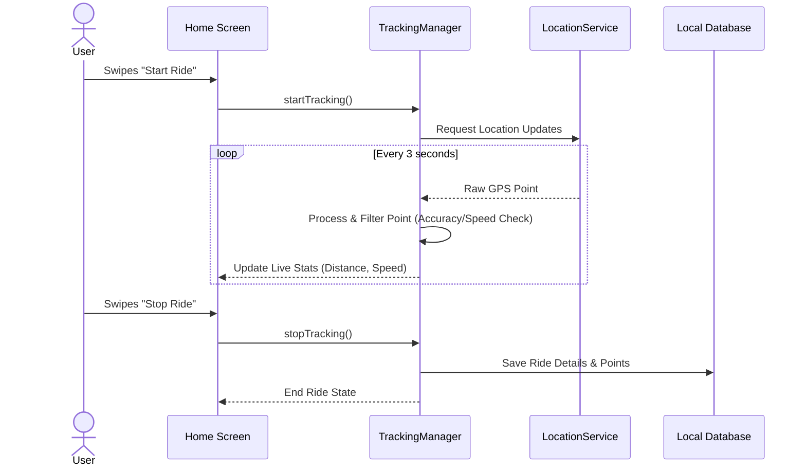

# TrackMe Android - Technical Documentation

Welcome to the TrackMe technical documentation. This guide is intended to help engineers understand the architecture, dependencies, and feature implementations of the project.

For product vision, feature behavior, and UX flows, please refer to the [Product Documentation](product_documentation.md).

## 1. Feature Implementations & Logic

This section breaks down the technical implementation for the core features described in the product docs.

### 1.1. Real-Time Tracking & Ride History
*   **Implementation:** Utilizes an Android Foreground Service (`TrackingService.kt`) to ensure tracking survives configuration changes and backgrounding. GPS points are fetched via `FusedLocationProviderClient`.
*   **Data Flow:** `TrackingManager.kt` receives raw GPS points, passes them to `GPSProcessor.kt` for accuracy/speed filtering, and emits updates to `HomeViewModel` via `StateFlow`.
*   **Storage:** Rides are saved to the local SQLite database using Room (`RideDao`). UI lists use `stickyHeader` for grouped views.
*   🔗 **Product Link:** [Real-Time Tracking Feature](product_documentation.md#11-real-time-tracking--ride-history)

### 1.2. Emergency SOS & Safety Beacon
*   **Implementation:** Handled by `EmergencyManager.kt`. When triggered, it initiates a 5-second coroutine delay (cancellation grace period). 
*   **Action:** If not canceled, it retrieves the last known location, formats a Google Maps URL, and uses `SmsManager` to broadcast the message to contacts stored in Room (`EmergencyDao`).
*   🔗 **Product Link:** [Emergency SOS Feature](product_documentation.md#12-emergency-sos--safety-beacon)

### 1.3. Live Ride Sharing
*   **Implementation:** Upon ride creation, if live sharing is enabled, a unique ride session ID is generated. 
*   **Data Sync:** The app streams real-time `(latitude, longitude, timestamp)` points to a specific Firebase Realtime Database or Firestore document. The shareable link points to a web viewer (or deep links) mapped to this session ID.
*   🔗 **Product Link:** [Live Ride Sharing Feature](product_documentation.md#13-live-ride-sharing)

### 1.4. Cloud Synchronization
*   **Implementation:** Uses Jetpack `WorkManager` (`SyncWorker.kt`) for background, periodic syncing.
*   **Database:** Combines Room (Local Source of Truth) and Firebase Firestore (Remote Backup). `FirestoreSyncManager` handles upstream inserts and lazy downstream fetches based on timestamp resolution to avoid conflicts.
*   🔗 **Product Link:** [Cloud Sync Feature](product_documentation.md#14-cloud-synchronization)

### 1.5. Data Export & GPX Interoperability
*   **Local GPX:** Implemented via Strategy/Adapter pattern. `GPXExporter.kt` formats local points into GPX 1.1 XML. `GPXParser.kt` ingests `.gpx` files to map to Room entities.
*   **Asynchronous Archive Export:** Complete historical data can be exported via a `POST` request to the `/api/export/request` backend endpoint. `SettingsViewModel.kt` submits the request and polls status via HTTP, aligning with backend queuing and rate-limiting policies.
*   🔗 **Product Link:** [Data Export & GPX Interoperability](product_documentation.md#15-data-export--gpx-interoperability)

### 1.6. Social Sharing (Image Export)
*   **Implementation:** Uses the Google Static Maps API to render the route polyline onto a static image map tile. 
*   **Processing:** `NativeSnapshotImageExporterImpl` overlays application statistics (distance, time) on top of the map bitmap using Android `Canvas` APIs before saving to local storage or opening the Share sheet.
*   🔗 **Product Link:** [Social Sharing Feature](product_documentation.md#16-social-sharing-image-export)

### 1.7. In-App Auto-Update Notifications
*   **Implementation:** On `MainActivity` initialization, the app queries Firebase Remote Config (`config/app_release`) and optionally the GitHub Releases API to compare the current `BuildConfig.VERSION_CODE` against the latest available version.
*   **Action:** Displays a Material 3 dialog containing the markdown release notes if a newer version is detected.
*   🔗 **Product Link:** [Auto-Update Feature](product_documentation.md#17-in-app-auto-update-notifications)

### 1.8. Multi-Language Localization
*   **Implementation:** Relies on standard Android `strings.xml` resource buckets (`values-es`, `values-fr`, etc.). App-level locale changes are handled via Android 13's per-app language preferences (`LocaleManager`) which dynamically updates the configuration context without requiring a hard restart.
*   🔗 **Product Link:** [Localization Feature](product_documentation.md#18-multi-language-localization)

---

## 2. Technical Architecture & Dependencies

### Core & UI
*   **Kotlin (1.9+)**: Primary language.
*   **Jetpack Compose & Material 3**: Declarative UI toolkit.
*   **Navigation Compose**: Screen routing.

### Data Storage, Cloud & Networking
*   **Room Database**: Local SQLite abstraction.
*   **Firebase**: Auth (Google Sign-In), Firestore, Crashlytics.
*   **Networking**: Standard `HttpURLConnection` for communicating with the backend API (`/api/track` and `/api/export`).

### Architecture Patterns
1.  **MVVM (Model-View-ViewModel)**: UI observes `StateFlow`. ViewModels handle intents.
2.  **Repository Pattern**: `DataRepository` abstracts Room and Firestore.
3.  **Observer Pattern**: Heavy use of Kotlin Coroutines & Flow.

---

## 3. Codebase Structure

```
trackme/
├── MainActivity.kt         // Entry point
├── Navigation.kt           // Defines Nav Graph
├── ui/                     // Compose Screens and ViewModels
├── service/                // TrackingService, EmergencyManager
├── data/                   // Repository, local (Room), remote (Firestore)
├── domain/                 // Business Logic (GPSProcessor, Exporters)
└── utils/                  // Loggers, helpers
```

---

## 4. Credentials and Configuration

*   **`local.properties`**: API Keys (`MAPS_API_KEY`) and Keystore passwords are kept here and NOT checked into version control.
*   **`google-services.json`**: Firebase configuration file placed in `app/`.
*   **`AppConfig.kt`**: Contains all non-secret business constants (colors, map styles, padding).

---

## 5. System Sequence Diagrams

### Tracking Lifecycle Sequence


